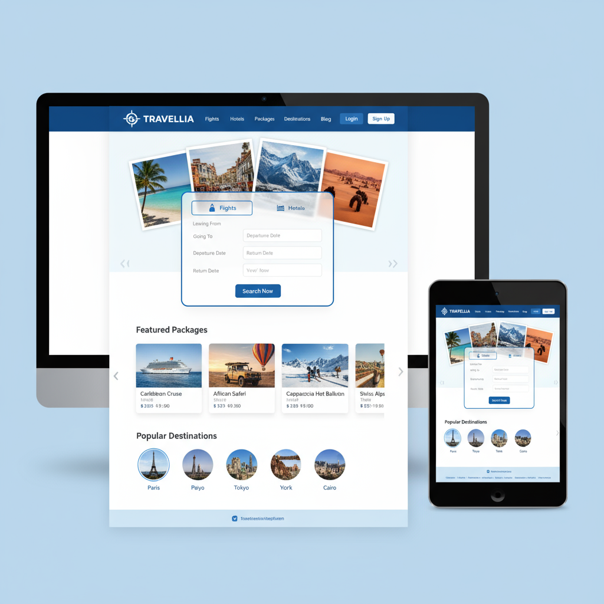
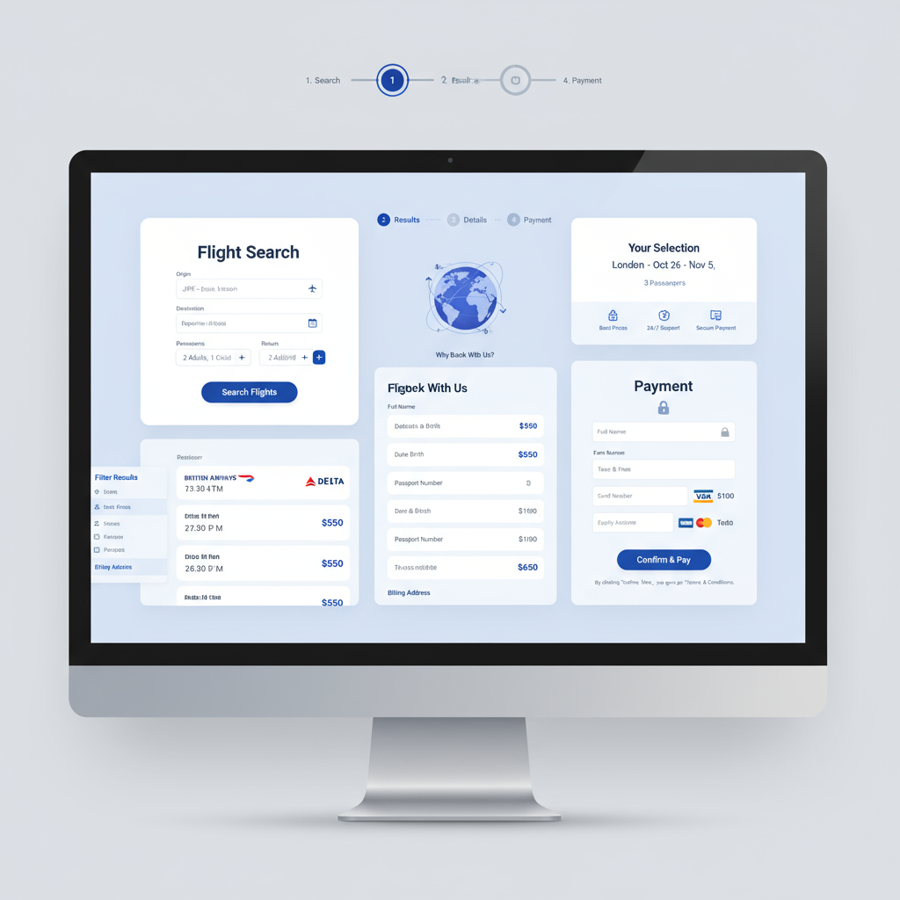
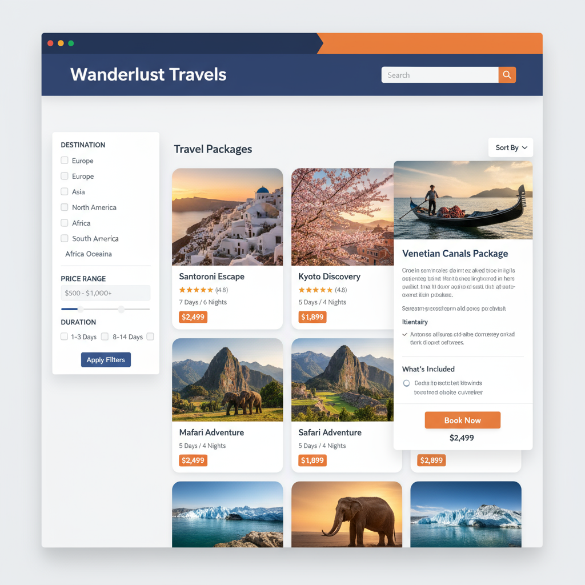
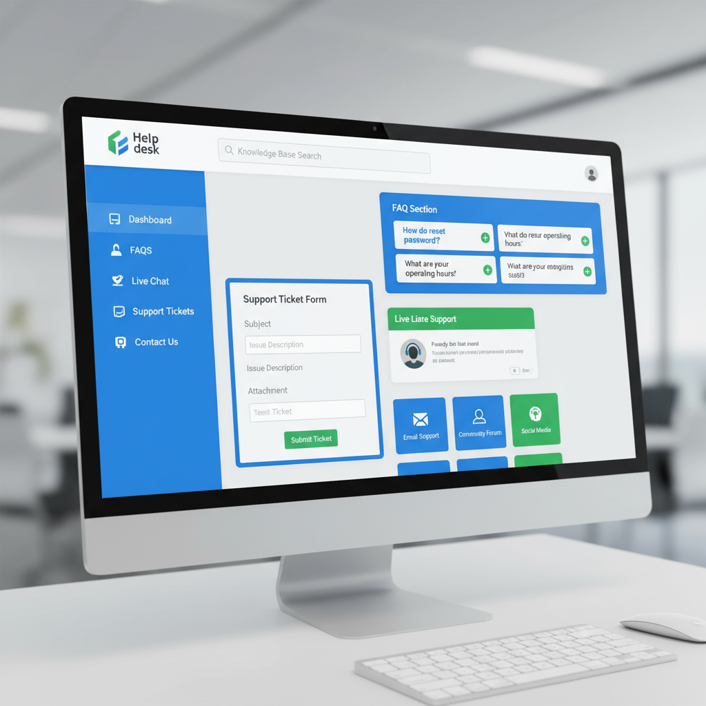
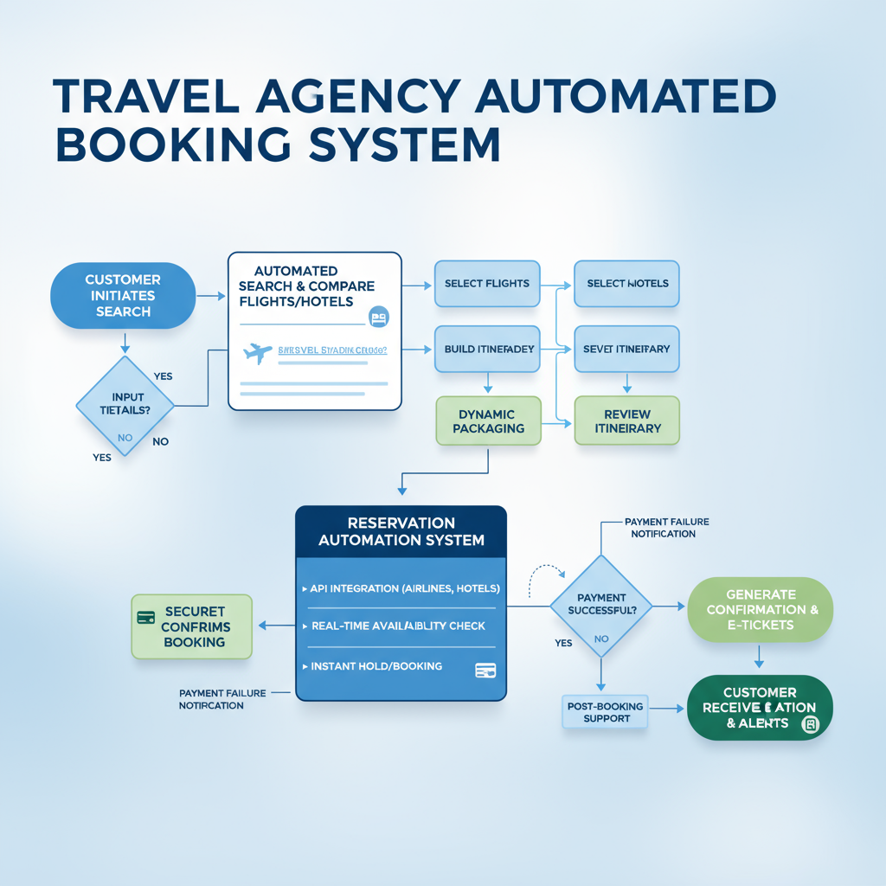
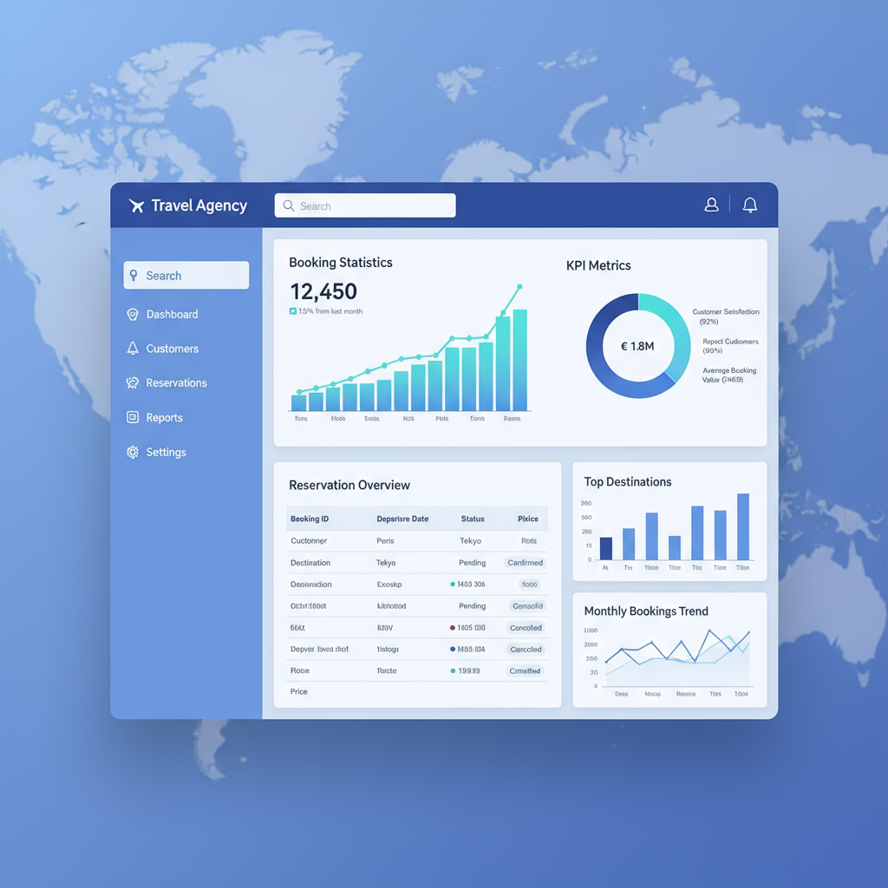

# Protótipos do Sistema ViagemFácil

## Visão Geral

Este documento apresenta os protótipos visuais do sistema de agência de viagens ViagemFácil, demonstrando as principais funcionalidades e interfaces do sistema.

## 1. Página Inicial (Home)

### Características Principais:
- **Hero Section**: Área de destaque com formulário de busca rápida
- **Navegação Intuitiva**: Menu principal com acesso a todas as funcionalidades
- **Busca Integrada**: Formulário para busca de voos e hotéis
- **Pacotes em Destaque**: Seção com os pacotes mais populares
- **Destinos Populares**: Galeria de destinos mais procurados
- **Design Responsivo**: Adaptável para desktop e mobile

### Funcionalidades Demonstradas:
- Sistema de busca automática
- Navegação por abas (Voos, Hotéis, Pacotes)
- Cards interativos de destinos
- Call-to-actions estratégicos

## 2. Sistema de Reservas

### Características Principais:
- **Processo Step-by-Step**: Indicadores visuais de progresso
- **Formulário de Busca**: Interface intuitiva para seleção de critérios
- **Resultados Organizados**: Listagem clara de opções disponíveis
- **Seleção Facilitada**: Interface para escolha de voos e hotéis
- **Processo de Pagamento**: Sistema seguro e integrado

### Funcionalidades Demonstradas:
- Automação de busca em tempo real
- Comparação de preços e horários
- Seleção múltipla (voo + hotel)
- Validação de dados em tempo real
- Processamento de pagamento seguro

## 3. Catálogo de Pacotes

### Características Principais:
- **Sistema de Filtros**: Busca por destino, preço, duração
- **Grid Responsivo**: Layout adaptável para diferentes telas
- **Cards Informativos**: Informações completas de cada pacote
- **Modal de Detalhes**: Visualização expandida com itinerário
- **Sistema de Avaliações**: Ratings e comentários de clientes

### Funcionalidades Demonstradas:
- Filtragem avançada de pacotes
- Ordenação por diferentes critérios
- Visualização detalhada de itinerários
- Sistema de reserva integrado
- Comparação de preços e benefícios

## 4. Central de Atendimento

### Características Principais:
- **FAQ Interativo**: Perguntas frequentes organizadas por categoria
- **Chat Online**: Atendimento em tempo real
- **Sistema de Tickets**: Abertura de chamados de suporte
- **Base de Conhecimento**: Busca em artigos de ajuda
- **Múltiplos Canais**: Diferentes formas de contato

### Funcionalidades Demonstradas:
- Chatbot inteligente para atendimento 24/7
- Sistema de tickets para problemas complexos
- FAQ categorizado e pesquisável
- Escalação automática para atendentes humanos
- Histórico de interações

## 5. Fluxo de Automação

### Processo Automatizado:
1. **Iniciação**: Cliente inicia busca no sistema
2. **Busca Inteligente**: Sistema compara opções automaticamente
3. **Seleção**: Cliente escolhe voos e hotéis
4. **Empacotamento**: Sistema cria itinerário personalizado
5. **Reserva**: Processamento automático da reserva
6. **Pagamento**: Sistema seguro de pagamento
7. **Confirmação**: Geração automática de vouchers e e-tickets

### Benefícios da Automação:
- Redução de tempo de processamento
- Eliminação de erros manuais
- Disponibilidade 24/7
- Integração com fornecedores
- Confirmação instantânea

## 6. Dashboard Administrativo

### Características Principais:
- **KPIs em Tempo Real**: Métricas de performance
- **Gráficos Interativos**: Visualização de dados de vendas
- **Gestão de Reservas**: Controle completo das reservas
- **Relatórios**: Análises detalhadas de performance
- **Gestão de Clientes**: Base de dados centralizada

### Funcionalidades Administrativas:
- Monitoramento de vendas em tempo real
- Gestão de inventário de pacotes
- Análise de satisfação do cliente
- Controle financeiro integrado
- Relatórios personalizáveis

## Tecnologias Utilizadas nos Protótipos

### Frontend:
- **HTML5**: Estrutura semântica das páginas
- **CSS3**: Estilização moderna e responsiva
- **JavaScript**: Interatividade e funcionalidades dinâmicas
- **Font Awesome**: Ícones profissionais
- **Design Responsivo**: Compatibilidade mobile

### Funcionalidades Implementadas:
- Sistema de navegação responsivo
- Formulários com validação
- Modais e pop-ups interativos
- Animações e transições suaves
- Simulação de APIs para demonstração

## Benefícios do Sistema

### Para os Clientes:
- **Facilidade de Uso**: Interface intuitiva e amigável
- **Rapidez**: Processo de reserva automatizado
- **Transparência**: Preços e condições claras
- **Suporte 24/7**: Atendimento sempre disponível
- **Personalização**: Pacotes adaptados às necessidades

### Para a Agência:
- **Eficiência Operacional**: Automação de processos
- **Redução de Custos**: Menos trabalho manual
- **Aumento de Vendas**: Sistema otimizado para conversão
- **Gestão Centralizada**: Controle total das operações
- **Análise de Dados**: Insights para tomada de decisão

## Próximos Passos

1. **Implementação Completa**: Desenvolvimento do sistema funcional
2. **Integração com APIs**: Conexão com fornecedores reais
3. **Testes de Usabilidade**: Validação com usuários reais
4. **Otimização de Performance**: Melhorias de velocidade
5. **Lançamento Gradual**: Implementação por fases

Este sistema representa uma solução completa para automação de agências de viagens, combinando tecnologia moderna com experiência do usuário otimizada.

